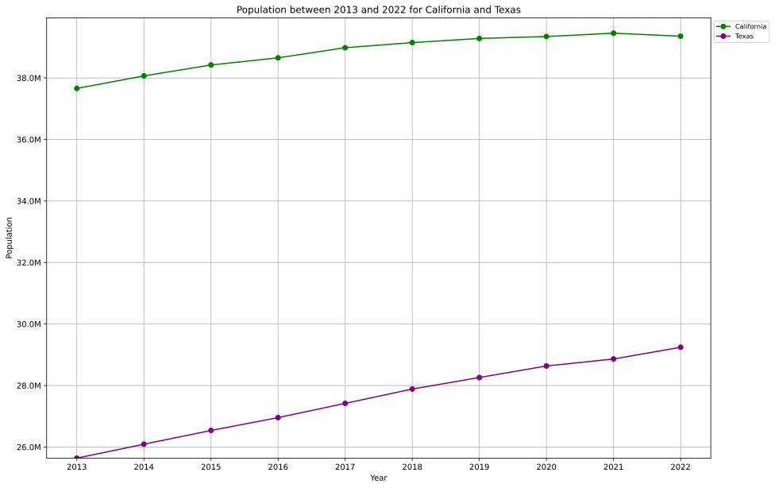
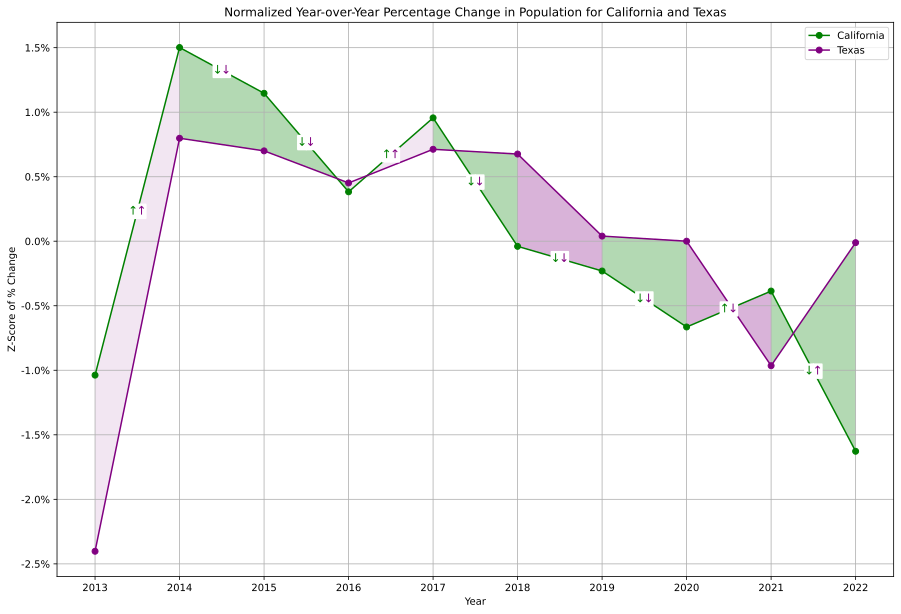
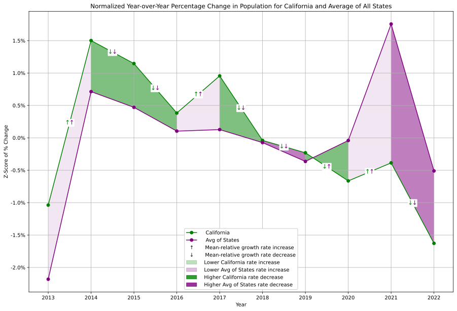
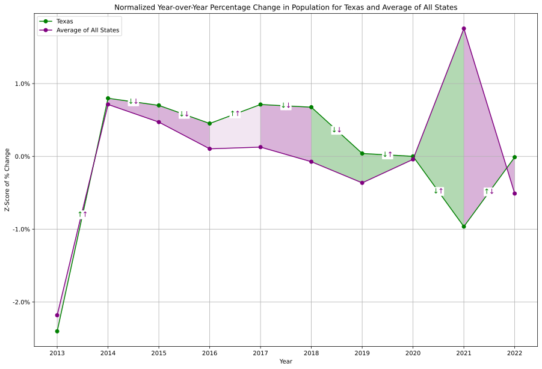
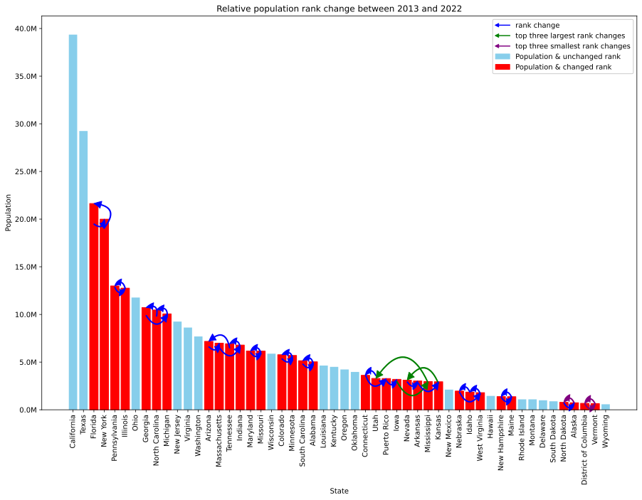
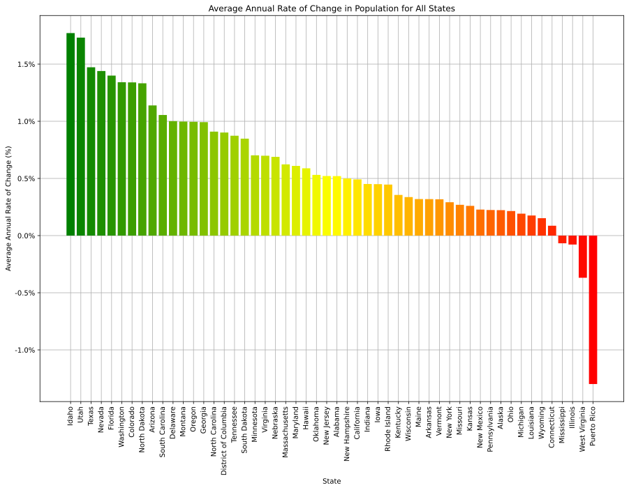

<!--
This presentation shows exploratory data analysis results of population trends in CA and TX to answer the question of whether Californians are moving to Texas
-->

# **Population Trends in California and Texas**
### _Are Californians Moving to Texas?_
##### Aaron Holmes 2024-07-03

---

## A Common Refrain

<!--
This question interested me because it's often reported that Californians are leaving for Texas; but is it true?
-->

---

## Population is Growing

<!--
At first glance, we can see that population in both CA and TX are growing, with general upward trends, with the exception of:

In 2021 and 2022:
- a small loss of ~99k people in California 
- a gain of ~381k people in Texas

However, this is insufficient to answer our question.
-->

---

## Similar Rate Changes

<!--
Looking at the trend lines from the previous slide does not show us a clear comparison of growth rates, so here we are looking directly at how much each state's population growth rate rose or fell relative to the average between them. We call that the z-score:

(explain chart)
- a z-score indicates how much higher or lower the population growth rate change is from the average population growth rate change between both states
- green is CA, purple is TX
- each colored arrow shows whether its corresponding state's growth rate is rising or falling for that year, to make it clearer when rate lines are parallel 
- the arrows are placed on the CA line for presentation, but there is no significance regarding this
- the darker shaded colors indicate which state has a higher decrease in each time period
- the lighter shaded colors indicate which state had a lower increase in each time period
- in the case of one state with a decrease and the other state with an increase, the shaded color represents the state with a decrease

Some examples of interesting trends are between 2013 and 2014, and 2016 and 2017 where we see both states had a growth rate increase, and the shaded area indicates TX has the lower rate increase.

Between 2020 and 2021, we see both states had growth rate decreases because the rate falls below 0, however, TX had a steeper growth rate decrease, which we can see both from the trend lines and the shaded area.

Inversely, between 2021 and 2022, compared to the mean, CA's growth rate change is dramatically lower, and is lower than TX's growth rate change.
-->

---

## California and National Average

<!--
Here we can see the same type of comparison, but between CA and the average growth rate of every other state.

- in this and the following chart, green represents the state, purple represents the avg of all states

Comparing CA to the national avg:

Again between 2013 and 2014, and between 2016 and 2017, CA had a higher growth rate increase compared to the AVG of all other states.

Between 2020 and 2021, CA still has a growth rate decrease, but it is smaller than the prior year's. We also see that the national AVG has a large increase in growth rate.

Then between 2021 and 2022, we see CA and the national AVG of all other states have a growth rate decrease, with the shaded area indicating that the national AVG's rate decrease was steeper.
-->

---

## Texas and National Average

<!--
And here we can see the comparison between TX and the average growth rate of every other state.

Between 2013 and 2014, and between 2016 and 2017 both TX and the national AVG of all other states had a growth rate increase, with TX having a higher rate increase.

Between 2020 and 2021, TX, like CA, show a growth rate decrease while the national AVG of all other states shows a rate increase.

Between 2021 and 2022 we show this trend reversed, where the growth rate for TX has increased relative to the AVG of all states.

-

Among all the graphs, we see similar trends in growth rates comparing TX and CA, and against the avg of all states. Because there is no clear difference between the CA and TX comparison, and the national average comparisons, perhaps there is no correlation between TX and CA directly, but we are instead seeing trends across all states.
-->

---

## Overall Ranking Unchanged

<!--
Some final observations on population:
- This chart shows overall population ranking between 2013 - 2022, where "rank" means each state's relative position in order of the number of people in each state
- CA and TX remain the most populous states
- CA has the largest population
- The ranking of population growth of CA and TX between 2013 - 2022 remains unchanged 

For completeness, all states are shown here. The red bars indicate states whos population rank did change between 2013 - 2022, with the arrows pointing from their previous rank, to their current rank.
-->

---

## California and Texas are Growing

<!--
And a final observation on population growth rates:
- This chart shows the average annual growth rates and losses between 2013 and 2022 for all states. Anything above 0 is growth, and below 0 is loss.
- Both CA and TX have a positive growth rate
- TX has a higher growth rate than CA
-->

---

## Conclusions

* Rate changes for both states follow similar trends
* California and Texas remain the most populous states
* 2022 shows a dramatic change in rate, with a decrease in California and increase in Texas
* Data are limited and inconclusive but may warrant further investigation to answer whether Californians are moving to Texas
