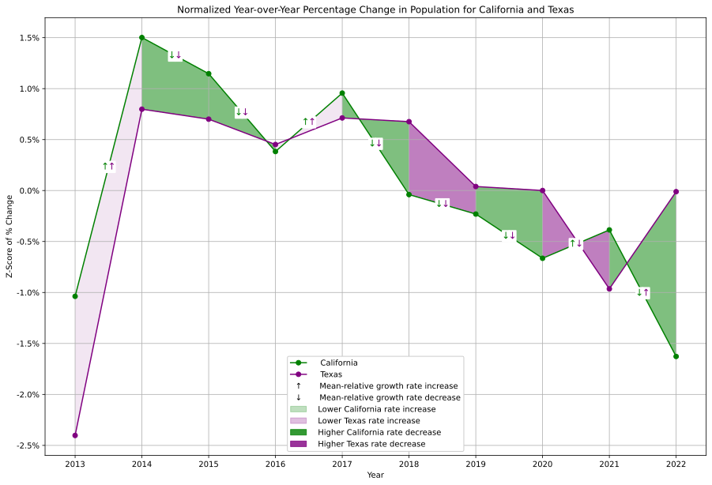

# **Population Trends in California and Texas**
### _Are Californians Moving to Texas?_
##### Aaron Holmes 2024-06-19

---

## A Common Refrain

---

## Population is Growing

---

## Normalized Changes Tell a Different Story

---

## California and National Average

---

## Texas and National Average

---

## Overall Ranking Unchanged

---

## California and Texas are Growing

---

## Conclusions

* Rate changes for both states follow similar trends
* California and Texas remain the most populous states
* 2022 shows a dramatic change in rate, with a decrease in California and increase in Texas
* Data are limited and inconclusive but may warrant further investigation
