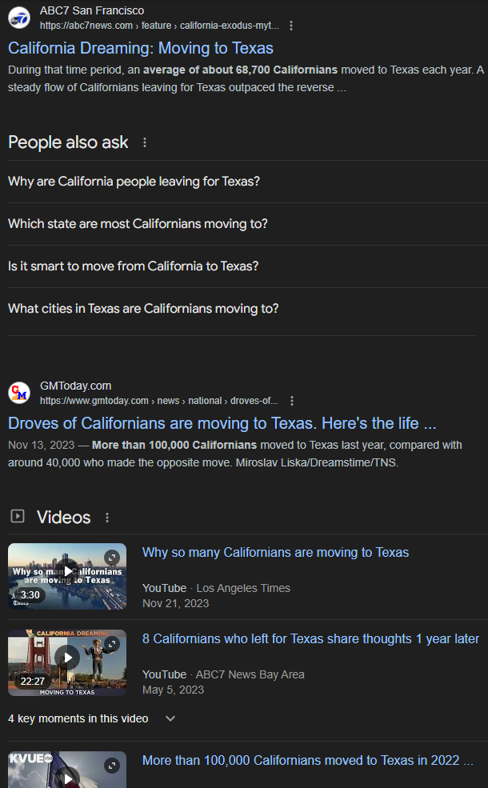
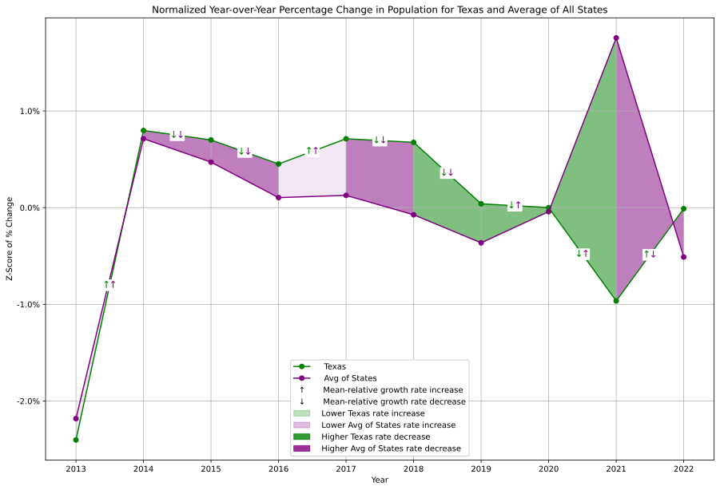
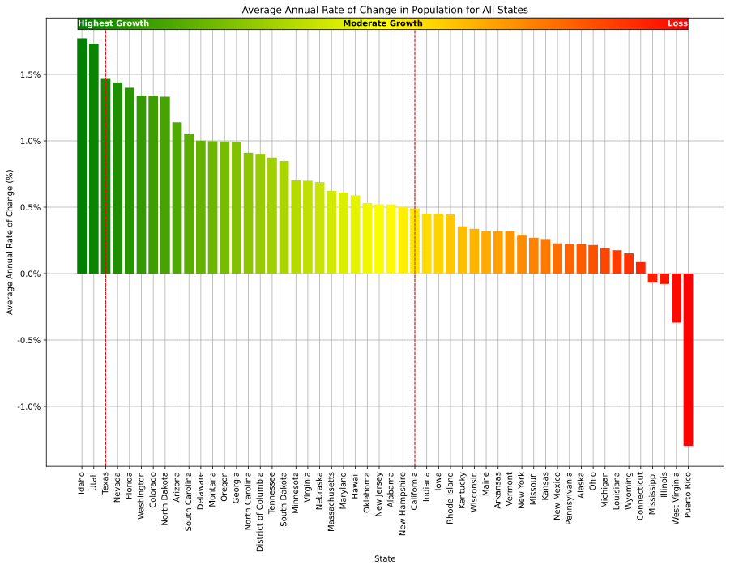

# **Population Trends in California and Texas**
### _Are Californians Moving to Texas?_
##### Aaron Holmes 2024-06-19

---

## A Common Refrain

<!--
Often reported that Californians are leaving for Texas.
Commonly held belief, but is it true?
-->

---

## Population is Growing

<!--
Population is growing for both states.

'21 and '22
Small loss of ~99k for California between 
Gain of ~381k for Texas in the same time period.
-->

---

## Similar Rate Changes

<!--
Year-over-year normalized growth rate changes follow similar trends
in most years except:

'13 - '14 & '16 - '17, California grew faster than Texas.

'20 - '21, higher growth rate for California & a loss for Texas.

'21 - '22, higher groth rate for Texas & a loss for California.
-->

---

## California and National Average

<!--
Comparing CA to the national avg:

Again in '13 - '14 & '16 - '17, higher rate increase in CA.

'20 - '21, CA maintains growth rate relative to mean of avg of all states, & mean of all states has has grown.

'21 - '22, CA and avg has lowered growth rate, but CA's rate decrease is smaller than avg's decrease.

-->

---

## Texas and National Average

<!--
Comparing TX to the national avg:

In '13 - '14 & '16 - '17, TX and avg increased, but TX increase is higher than mean of avg of all states.

'20 - '21, TX rate decrease, while avg rate of all states has increased.

'21 - '22, TX rate increase while avg of all states has decreased.

-

between all the graphs, we see similar trends in growth rates comparing TX and CA, and against the avg of all states. So perhaps there is no correlation between TX and CA directly, but we are seeing trends across all states.
-->

---

## Overall Ranking Unchanged

<!--
Quick comparison of overall population rankings between '13 and '22.

TX and CA ranks are unchanged regardless of
overall population trends we saw.
-->

---

## California and Texas are Growing

<!--
Avg annual grow rate change between '13 and '22.

We do see that TX is growing more quickly on
avg than CA, however, both states are continuing to grow.
-->

---

## Conclusions

* Rate changes for both states follow similar trends
* California and Texas remain the most populous states
* 2022 shows a dramatic change in rate, with a decrease in California and increase in Texas
* Data are limited and inconclusive but may warrant further investigation
